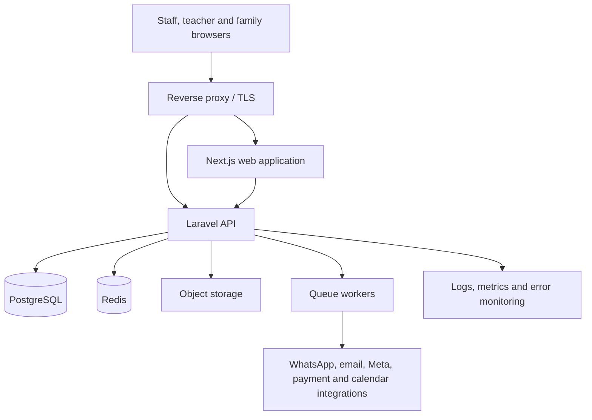

# 01 — Technical Architecture

## 1. Architectural outcome

EduStep Academy OS will be an **API-first modular monolith**:



This keeps one deployable backend and one deployable frontend while preserving
clear module ownership. It avoids the operational cost and distributed
transactions of microservices before EduStep has the scale that would justify
them.

---

## 2. Runtime baseline

| Layer | Decision | Reason |
|---|---|---|
| Backend | Laravel 13 | Current supported Laravel major with security support through March 2028 |
| PHP | PHP 8.4 | Stable local/runtime baseline and compatible with Laravel 13 |
| Frontend | Current stable Next.js, App Router | Recommended router for new Next.js applications |
| JavaScript runtime | Node.js 24 LTS | Production LTS; Node 26 remains Current until its LTS transition |
| Language | TypeScript strict | Safer contracts and refactoring |
| Database | PostgreSQL 18 current minor | Strong relational integrity, JSON, full-text and reporting support |
| Cache/queue | Redis current stable | Shared cache, locks, queues and rate limits |
| Files | S3-compatible object storage | Durable uploads, signed access and CDN-ready delivery |
| Local development | Docker Compose | Reproducible PHP, Node, PostgreSQL, Redis and mail environment |

Versions are pinned in lockfiles and container images. Framework major upgrades
are planned work; minor and security patches are automated through controlled
pull requests and test gates.

---

## 3. Production routing

Use one public application origin:

```text
https://app.edustep.example/                Next.js
https://app.edustep.example/api/v1/...      Laravel
https://app.edustep.example/sanctum/...     Laravel Sanctum
https://app.edustep.example/storage/...     Signed or proxied assets where needed
```

Benefits:

- First-party secure cookies.
- Minimal CORS complexity.
- Consistent CSRF protection.
- Simpler browser and PWA behavior.
- One observable request path.

Internally, the reverse proxy routes traffic to separate Next.js and Laravel
services. The API remains independently deployable and can later be exposed on
a dedicated integration hostname if required.

---

## 4. Authentication architecture

### Browser sessions

Laravel Sanctum handles first-party SPA authentication:

1. Browser requests CSRF cookie.
2. Login credentials are posted to Laravel.
3. Laravel rotates and stores the authenticated session.
4. Browser receives a secure, HTTP-only, same-site cookie.
5. Next.js calls `/api/v1` with credentials included.
6. Laravel policies authorize every protected operation.

Security defaults:

- Secure cookies in production.
- HTTP-only session cookie.
- SameSite=Lax unless a reviewed deployment topology requires otherwise.
- Session rotation on login and privilege change.
- Session invalidation after password reset.
- Optional forced logout of other devices.
- Login throttling and account lockout escalation.
- 2FA required for owner, finance and high-privilege staff before production.

### Integration tokens

Personal or service tokens are separate from browser sessions:

- Hashed at rest.
- Named and scoped.
- Optional expiry.
- Last-used timestamp.
- Revocable.
- Never used by the Next.js browser client.

---

## 5. Backend structure

### Module map

```text
apps/api/app/Modules/
├── IdentityAccess/
├── Organization/
├── CRM/
├── People/
├── Admissions/
├── Academics/
├── Scheduling/
├── LearningProgress/
├── Billing/
├── Payroll/
├── Communications/
├── SupportQuality/
├── Reporting/
└── Integrations/
```

### Internal module convention

```text
CRM/
├── Actions/
├── Data/
├── Enums/
├── Events/
├── Exceptions/
├── Http/
│   ├── Controllers/Api/V1/
│   ├── Requests/
│   └── Resources/
├── Jobs/
├── Listeners/
├── Models/
├── Notifications/
├── Policies/
├── Queries/
├── Rules/
└── Services/
```

### Responsibility rules

- Controllers translate HTTP to application calls; they do not hold business logic.
- Form Requests validate syntax and request-level rules.
- Actions implement one business use case such as `ConvertLeadToEnrollment`.
- Policies enforce capability and record scope.
- Models hold relationships, casts, invariants close to persistence, and small domain behavior.
- Query classes build complex lists, filters and dashboard reads.
- Jobs perform slow or external work.
- Events describe completed business facts.
- Listeners respond without making the original transaction fragile.
- API Resources define output contracts.

Avoid:

- Generic `BaseRepository` layers that only wrap Eloquent.
- Large service classes containing unrelated workflows.
- Model observers for important invisible business actions.
- Cross-module writes that bypass the owning module action.

---

## 6. Transaction and consistency policy

Use database transactions for:

- Lead conversion.
- Enrollment and seat allocation.
- Session completion.
- Attendance plus make-up credit issuance.
- Invoice issuance.
- Payment allocation.
- Refund and credit creation.
- Teacher earning generation.
- Payroll period locking.
- Student transfer.

### Transaction pattern

1. Validate permissions and state.
2. Begin transaction.
3. Lock sensitive rows where concurrent updates are possible.
4. Apply state transition.
5. Add audit and outbox records.
6. Commit.
7. Dispatch asynchronous work after commit.

External HTTP calls never run inside the database transaction.

### Concurrency protection

- Unique constraints for deduplication and one-time effects.
- Row-level locks for seat allocation, payment allocation and payroll closing.
- `version` integer on records vulnerable to simultaneous form edits.
- Idempotency keys on external and financially sensitive operations.
- Database constraints for totals and status combinations where practical.

---

## 7. Events, outbox and queues

### Domain events

Examples:

- `LeadCreated`
- `LeadAssigned`
- `PlacementBooked`
- `PlacementCompleted`
- `OfferAccepted`
- `PaymentRecorded`
- `EnrollmentActivated`
- `SessionCompleted`
- `StudentMarkedAbsent`
- `MakeupCreditGranted`
- `ProgressRiskDetected`
- `InvoiceOverdue`
- `LevelCompletionApproaching`

### Outbox

Events that must reach external systems create an `outbox_events` record in the
same database transaction as the business change. A worker publishes or handles
the event and records attempts.

This prevents cases such as:

- Payment saved but receipt message lost.
- Enrollment activated but welcome notification not queued.
- Attendance saved but parent absence notification skipped.

### Queue lanes

| Queue | Examples | Priority |
|---|---|---|
| `critical` | Payment reconciliation, enrollment activation | Highest |
| `default` | Internal async calculations | Normal |
| `notifications` | WhatsApp, email, SMS | Normal |
| `integrations` | Meta, calendar, payment callbacks | Normal |
| `imports` | CSV import and validation | Low |
| `reports` | PDF reports, exports, aggregates | Low |

Jobs define:

- Timeout.
- Maximum attempts.
- Exponential backoff.
- Idempotency behavior.
- Exception classification.
- Dead-letter or failed-job review path.

Laravel Horizon is used for Redis queue visibility in staging and production.

---

## 8. Scheduler

Laravel Scheduler triggers:

- Lead SLA checks.
- Appointment reminders.
- Session reminders.
- Incomplete session-report reminders.
- Upcoming and overdue installment checks.
- Enrollment expiration and renewal workflow.
- Assessment due checks.
- Teacher-document expiry reminders.
- Materialized reporting refresh.
- Audit and failed-job retention cleanup.
- Daily backup verification signal.

Every scheduled command:

- Is safe to run twice.
- Uses overlap prevention where needed.
- Uses one-server locking in multi-instance deployment.
- Dispatches heavy work to queues.
- Records metrics and failure details.

---

## 9. Frontend structure

```text
apps/web/src/
├── app/
│   ├── (auth)/
│   ├── (staff)/
│   ├── (teacher)/
│   ├── (family)/
│   ├── api-health/
│   ├── error.tsx
│   ├── loading.tsx
│   └── not-found.tsx
├── components/
│   ├── ui/
│   ├── data-display/
│   ├── forms/
│   ├── navigation/
│   └── feedback/
├── features/
│   ├── crm/
│   ├── people/
│   ├── admissions/
│   ├── academics/
│   ├── scheduling/
│   ├── learning-progress/
│   ├── billing/
│   ├── payroll/
│   └── reporting/
├── lib/
│   ├── api/
│   ├── auth/
│   ├── i18n/
│   ├── permissions/
│   ├── telemetry/
│   └── validation/
├── providers/
├── styles/
└── types/
```

### Rendering strategy

- Public/auth shell may use Server Components.
- Authenticated operational screens use App Router layouts with client-side server-state queries.
- Initial page data may be prefetched server-side only where session forwarding remains simple and measurable.
- Interactive tables, filters, forms and calendars are Client Components.
- URL search parameters store shareable filter and tab state.
- Sensitive data is never placed in static caches.

### State ownership

| State | Tool/owner |
|---|---|
| Server data | TanStack Query |
| Form state | React Hook Form |
| URL filters | Next.js search params |
| Authentication | Laravel session + current-user query |
| Small UI state | Local React state |
| Cross-screen temporary UI | Small dedicated store only if proven necessary |

No global Redux-style store is introduced by default.

---

## 10. API contract workflow

OpenAPI 3.1 is the integration contract:

1. Laravel endpoint and request/resource behavior are defined.
2. Contract tests verify examples and error shapes.
3. OpenAPI schema is published from CI.
4. TypeScript types and API client definitions are generated.
5. Frontend compilation fails on incompatible contract changes.
6. Breaking changes require a new API version or explicit migration.

This prevents the frontend and backend from drifting independently.

---

## 11. Caching strategy

Cache only measured or naturally reusable data:

- Permission map per user.
- Reference lists: branches, levels, programs, statuses.
- Expensive dashboard aggregates.
- Rate-limit counters.
- Temporary integration tokens.
- Distributed locks.

Do not cache:

- Mutable invoice balances without event invalidation.
- Payment state as an independent source of truth.
- Fine-grained permission decisions for too long.
- Sensitive family or child data in public/shared caches.

Cache keys are namespaced and invalidated by module-owned events.

---

## 12. Search and reporting

### Search v1

PostgreSQL supports:

- Normalized exact phone search.
- Email search.
- Case-insensitive names.
- Student/group codes.
- Trigram/fuzzy search after measurement.

A separate search engine is deferred until database search is proven
insufficient.

### Reporting v1

- Query services for operational screens.
- Database views for stable metrics.
- Scheduled aggregate tables for expensive dashboards.
- CSV/XLSX exports produced asynchronously.
- Every metric has a definition, owner, timezone and date basis.

---

## 13. File storage

Files include:

- Teacher documents.
- Student documents.
- Payment proofs.
- Assessment attachments.
- Progress reports and certificates.
- Session resources.

Rules:

- Store object key and metadata in PostgreSQL, not file bytes.
- Private by default.
- Short-lived signed download URLs.
- MIME, size and extension validation.
- Virus scanning hook before file becomes available.
- Access checked before issuing a signed URL.
- Retention class recorded per document type.
- Public marketing assets remain separate from private academic files.

---

## 14. Observability

Every request receives a `request_id` shared across:

- Laravel logs.
- Next.js server logs.
- Queue jobs.
- Integration attempts.
- API error responses.
- Audit records where relevant.

Track:

- Request latency and error rate.
- Database slow queries.
- Queue depth and wait time.
- Job failure rate.
- External provider success/failure.
- Payment webhook delay.
- Message delivery rate.
- Login and authorization failures.
- Backup age and restore verification.

Sensitive fields are redacted from logs.

---

## 15. Architecture acceptance gate

Before implementation starts:

- Repository layout accepted.
- Same-origin routing accepted.
- Sanctum cookie authentication accepted.
- Modular monolith accepted.
- PostgreSQL and Redis hosting options accepted.
- Single-organization, branch-ready scope accepted.
- API response/error conventions accepted.
- Storage and backup ownership identified.
- Environments and production domain approach identified.
