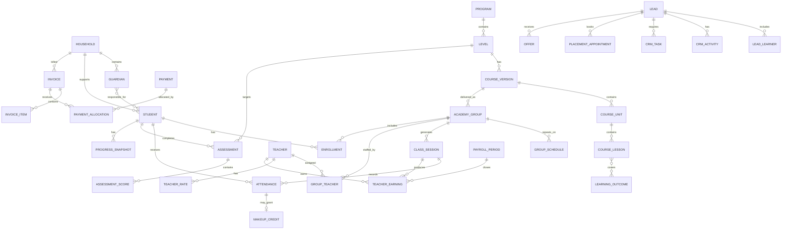

# 02 — Domain and Data Model

## 1. Data design goals

The model must support the complete learner journey without duplicating people,
losing financial history, or coupling academic progress to one temporary group.

Design priorities:

- One source of truth for each concept.
- Household payer separated from learner.
- Lead conversion without duplicate records.
- Enrollment separated from group and student.
- Session-level attendance and teacher earnings.
- Versioned pricing, policies, teacher rates and curriculum.
- Immutable financial history with reversals.
- Branch readiness without SaaS multi-tenancy.
- Arabic names and Egyptian phone normalization.
- Auditable state transitions.

---

## 2. Domain boundaries

| Context | Owns |
|---|---|
| Identity & Access | Users, roles, permissions, sessions, user scopes |
| Organization | EduStep organization, branches, rooms, holidays, settings |
| CRM | Leads, campaigns, stages, activities, tasks and conversion |
| People | Households, guardians, students, teachers, employees, consent and documents |
| Admissions | Placement appointments, assessments, trials and offers |
| Academics | Programs, tracks, levels, curriculum versions, outcomes and rubrics |
| Scheduling | Groups, schedules, sessions, enrollment, waitlists, attendance, make-up and transfer |
| Learning Progress | Scores, skill snapshots, report cards, interventions and certificates |
| Billing | Products, prices, invoices, installments, payments, allocations, credits, refunds and expenses |
| Payroll | Teacher rates, session earnings, periods, statements and payouts |
| Communications | Templates, messages, recipients, automations and delivery |
| Support & Quality | Requests, complaints, incidents, observations and improvement plans |
| Reporting & Audit | Metric aggregates, imports, exports, audit and outbox |

Each context is allowed to read another context through declared relationships
or query services. It writes another context only through that context's action.

---

## 3. Relationship overview



---

## 4. Global data conventions

### Identifiers

- Primary keys: ULID stored consistently.
- Human-facing codes are separate:
  - `STD-000123`
  - `GRP-KID-A1-026`
  - `INV-2026-001245`
  - `PAY-2026-000842`
- External provider identifiers have dedicated columns and unique constraints.

### Time

- Timestamps stored in UTC.
- Business timezone stored as `Africa/Cairo`.
- Local schedule rules store local wall-clock time plus timezone.
- Dates without time, such as birth date and invoice due date, remain `date`.
- Recurrence generation produces concrete UTC session timestamps.

### Money

- Amount columns use integer minor units.
- `125050` means EGP 1,250.50.
- Currency uses ISO code, default `EGP`.
- Never use floating point for money.
- Snapshots preserve the applied price, discount and rate at transaction time.

### Contact normalization

- Phone stored in E.164 when possible.
- Separate raw input may be retained for import traceability.
- Email lowercased for comparison.
- Arabic and English names have display fields; search normalization is separate.

### Deletion

- Reference/master data may be archived.
- People may be deactivated and handled under retention policy.
- Financial transactions are voided or reversed.
- Attendance and academic results are corrected through audited changes.
- Audit and provider webhook records have retention rules and are not user-deletable.

---

## 5. Identity and organization

### `users`

| Field | Notes |
|---|---|
| `id` | ULID |
| `name` | Login/display name |
| `email` | Unique when present |
| `phone_e164` | Unique when used for login |
| `password` | Hashed |
| `locale` | `ar` or `en` |
| `timezone` | Default Africa/Cairo |
| `status` | invited, active, suspended, archived |
| `email_verified_at` | Nullable |
| `phone_verified_at` | Nullable |
| `last_login_at` | Nullable |
| `two_factor_enabled_at` | Nullable |

### Access tables

- `roles`
- `permissions`
- `role_permissions`
- `user_roles`
- `user_branch_scopes`
- `access_overrides` only if a real exception appears

### Organization tables

- `organizations`
- `branches`
- `rooms`
- `organization_holidays`
- `branch_business_hours`
- `settings`

`settings` are typed, validated and namespaced. Critical policies such as
make-up and payroll are versioned domain records rather than anonymous settings.

---

## 6. CRM

### `leads`

| Field | Notes |
|---|---|
| `id` | ULID |
| `primary_contact_name` | Guardian or adult learner |
| `phone_e164` | Main deduplication field |
| `alternate_phone_e164` | Nullable |
| `email` | Nullable |
| `lead_type` | family, adult_learner |
| `source_id` | Channel |
| `campaign_id` | Nullable attribution |
| `stage_id` | Current pipeline stage |
| `owner_user_id` | Counselor |
| `priority` | low, normal, high, urgent |
| `preferred_mode` | online, onsite, hybrid, unknown |
| `preferred_language` | ar, en |
| `first_response_at` | SLA metric |
| `next_action_at` | Required for active stages |
| `lost_reason_id` | Required if lost |
| `converted_household_id` | Nullable |
| `converted_student_id` | Nullable for single learner shortcut |
| `status` | active, won, lost, deferred, archived |
| `version` | Optimistic concurrency |

### Supporting CRM tables

- `lead_sources`
- `marketing_campaigns`
- `lead_stages`
- `lead_stage_transitions`
- `lead_lost_reasons`
- `lead_learners`
- `crm_activities`
- `crm_tasks`
- `crm_notes`
- `crm_tags`
- `lead_tag`

### CRM invariants

- Active lead must have an owner after assignment grace period.
- Active contacted lead must have a next action unless in a terminal stage.
- Lost lead requires a reason.
- Won lead references the created or matched people records.
- Lead conversion is idempotent.
- A duplicate phone produces a merge/review path, not silent overwrite.

---

## 7. People

### Households and guardians

`households` owns:

- Billing identity.
- Preferred communication.
- Family-level discount eligibility.
- Current balance projection.
- Primary branch and account owner.

`guardians` owns:

- Person name and contact.
- Relationship defaults.
- Emergency/contact flags.
- Portal user link.

`guardian_student` includes:

- Relationship type.
- Legal/operational responsibility.
- Billing contact flag.
- Emergency contact flag.
- Pickup/authorized-person flag where relevant.
- Communication preference.

### Students

`students` includes:

- `student_code`
- Arabic and English display names
- Birth date
- Gender only if EduStep has a valid operational need
- School/grade fields if used
- Learning goals
- Current level summary
- Primary household
- Status
- Join and exit dates
- Exit reason
- Risk summary

Sensitive health or learning notes are separated into restricted records with
explicit visibility.

### Teachers

Core tables:

- `teachers`
- `teacher_specialties`
- `teacher_program_eligibility`
- `teacher_availability_rules`
- `teacher_time_off`
- `teacher_qualifications`
- `teacher_documents`
- `teacher_contracts`
- `teacher_onboarding_steps`
- `teacher_observations`
- `teacher_improvement_plans`

Teacher status:

```text
applicant → screening → interview → demo → approved → onboarding → active
                                                        ↓
                                              on_leave / suspended / left
```

### Consent and documents

- `consents`
- `consent_versions`
- `documents`
- `document_access_classifications`
- `document_expiry_reminders`

Consent is linked to the policy version, subject, guardian where required,
timestamp, channel and evidence.

---

## 8. Admissions

### Placement

- `placement_appointments`
- `placement_assessors`
- `placement_forms`
- `placement_form_versions`
- `placement_results`
- `placement_recommendations`

Appointment status:

```text
scheduled → confirmed → attended → completed
        ↘ rescheduled
        ↘ no_show
        ↘ cancelled
```

### Trials

- `trial_bookings`
- `trial_attendance`
- `trial_feedback`

A trial may reference a lead before student conversion. Conversion re-links it
to the resulting student while preserving lead history.

### Offers

- `offers`
- `offer_items`
- `offer_group_options`
- `offer_status_history`

Offer status:

```text
draft → sent → viewed → accepted → paid
                 ↘ expired
                 ↘ declined
                 ↘ withdrawn
```

Applied price and validity are snapshots. Accepting an offer does not overwrite
the source price list.

---

## 9. Academic catalog

### Hierarchy

- `programs`
- `tracks`
- `levels`
- `course_versions`
- `course_units`
- `course_lessons`
- `learning_outcomes`
- `lesson_learning_outcome`
- `skill_definitions`
- `rubrics`
- `rubric_levels`
- `assessment_templates`
- `assessment_template_components`

### Versioning

`course_versions` status:

- draft
- approved
- published
- retired

Groups reference a fixed published version. Publishing a new version never
changes historical or active groups automatically.

### Level alignment

Fields distinguish:

- EduStep marketing name.
- Internal sequence and sub-level.
- CEFR reference where applicable.
- Recommended age range.
- Expected instructional hours.
- Required attendance.
- Promotion requirements.

---

## 10. Groups, sessions and enrollment

### Groups

`academy_groups` includes:

- Group code.
- Program, level and course version.
- Branch/mode.
- Capacity minimum and maximum.
- Sales/open status.
- Start and projected end.
- Default product/price reference.
- Meeting-room or physical-room reference.
- Progress summary.

Supporting tables:

- `group_teachers`
- `group_schedules`
- `group_waitlist_entries`
- `group_status_history`

### Sessions

`class_sessions` includes:

- Concrete start/end timestamp.
- Group and room.
- Topic/unit/lesson.
- Status.
- Cancellation actor/reason.
- Reschedule source.
- Session lock timestamp.

Supporting:

- `session_teacher_assignments`
- `session_reports`
- `session_resources`
- `session_incidents`

### Enrollment

`enrollments` includes:

- Student and group.
- Status.
- Start/end.
- Applied product and policy versions.
- Price snapshot.
- Discount snapshot and approval.
- Included session/period limits.
- Freeze and make-up entitlement summary.
- Source lead/offer.

Supporting:

- `enrollment_status_history`
- `enrollment_holds`
- `enrollment_transfers`
- `enrollment_withdrawals`
- `enrollment_policy_snapshots`

### Enrollment state

```text
pending_offer → pending_payment → active → completed
                                  ↓
                                paused
                                  ↓
                               active
                                  ↓
                  transferred / withdrawn / cancelled
```

### Attendance

`attendance_records` has one row per student and session:

- Status.
- Arrival minutes.
- Recorded by and at.
- Billable flag.
- Make-up eligibility.
- Reason.
- Version and correction details.

Unique constraint: `(session_id, student_id)`.

### Make-up credits

`makeup_credits` includes:

- Student/enrollment.
- Source attendance or academy cancellation.
- Granted and expiry dates.
- Policy snapshot.
- Status: available, reserved, used, expired, revoked.
- Target session when reserved/used.

Unique source constraint prevents double-granting.

---

## 11. Learning progress

Core tables:

- `assessments`
- `assessment_components`
- `assessment_scores`
- `assessment_evidence`
- `skill_observations`
- `progress_snapshots`
- `report_cards`
- `report_card_sections`
- `student_interventions`
- `intervention_actions`
- `certificates`

### Assessment rules

- Assessment references template version and target level.
- Scores may be rubric, numeric, boolean or narrative.
- Published assessment is corrected through a new version/history entry.
- Parent-visible and internal comments are separate fields.
- CEFR-linked descriptors are distinguished from EduStep internal indicators.

### Risk

Risk signals are recorded separately:

- attendance
- performance
- engagement
- payment
- complaint
- teacher concern

An overall risk level is derived, but each signal remains explainable.
Every high-risk case has an owner, action and review date.

---

## 12. Billing

### Catalog and prices

- `products`
- `price_lists`
- `price_list_items`
- `discount_definitions`
- `discount_approvals`
- `billing_policy_versions`

### Invoices

- `invoices`
- `invoice_items`
- `installment_schedules`
- `invoice_status_history`

Invoice amount equation:

```text
subtotal - discounts + approved fees/taxes = total
total - allocated payments - credits + reversals = balance
```

### Payments

- `payments`
- `payment_allocations`
- `payment_proofs`
- `payment_provider_events`
- `refunds`
- `credit_notes`
- `credit_note_allocations`

### Payment invariants

- Provider event identifier is unique.
- Allocation total cannot exceed available payment amount.
- Allocation points to an issued invoice.
- Refund total cannot exceed refundable amount.
- Payment status changes preserve provider history.
- Manual payment has recorder and verification status.
- Voided invoice keeps original rows.

### Expenses

- `expense_categories`
- `vendors`
- `expenses`
- `expense_approvals`
- `expense_payments`

Expenses support branch/cost-center attribution and attachment evidence.

---

## 13. Teacher payroll

### Tables

- `teacher_rate_rules`
- `teacher_rate_rule_versions`
- `teacher_earnings`
- `teacher_earning_adjustments`
- `payroll_periods`
- `payroll_statements`
- `payroll_statement_lines`
- `teacher_payouts`

### Earning generation

When a session becomes eligible:

1. Resolve assigned teacher.
2. Resolve effective rate rule.
3. Snapshot rule inputs.
4. Calculate earning.
5. Store source session and calculation trace.
6. Prevent duplicate earning for the same teacher/session/role.

### Locking

Payroll period state:

```text
open → review → approved → paid → locked
```

After lock:

- Source changes produce an adjustment in a later open period.
- Historical statement is not rewritten.
- Unlock requires owner-level permission and audit reason.

---

## 14. Communications and automation

Tables:

- `message_templates`
- `message_template_versions`
- `messages`
- `message_recipients`
- `message_delivery_attempts`
- `communication_preferences`
- `automation_rules`
- `automation_rule_versions`
- `automation_runs`
- `automation_actions`
- `outbox_events`
- `webhook_receipts`
- `integration_connections`

Messages store provider identifiers and delivery state, but external chat
history is not treated as the source of CRM tasks or decisions.

---

## 15. Support, quality and audit

### Support

- `service_requests`
- `service_request_messages`
- `service_request_status_history`
- `complaints`
- `incidents`
- `incident_actions`

Child-safeguarding incidents use restricted permission and redacted reporting.

### Quality

- `teacher_observation_templates`
- `teacher_observations`
- `observation_scores`
- `improvement_plans`
- `satisfaction_surveys`
- `survey_responses`

### Audit and operations

- `audit_entries`
- `data_imports`
- `data_import_rows`
- `data_exports`
- `outbox_events`
- `webhook_receipts`
- `integration_attempts`

Audit fields:

- Actor and impersonator if any.
- Action.
- Subject type/id.
- Before/after diff with sensitive values redacted.
- Request id.
- IP and user agent where appropriate.
- Timestamp.
- Reason for privileged override.

---

## 16. Critical indexes and constraints

Initial index plan:

- Unique normalized phone where business rules permit.
- Lead stage + owner + next action.
- Student code.
- Group code.
- Sessions by group/start and teacher/start.
- Attendance unique session/student.
- Enrollment by student/status and group/status.
- Invoice account/status/due date.
- Payment provider/reference unique.
- Payment allocation invoice/payment.
- Teacher earning teacher/period and unique source.
- Tasks owner/status/due date.
- Messages recipient/status/scheduled date.
- Audit subject/time and actor/time.

Indexes are confirmed with real query plans; speculative indexes are avoided.

---

## 17. Seed and demo data

Development and staging receive deterministic factories for:

- One organization and two example branches.
- Staff users across every role.
- Kids, teens and adult programs.
- CEFR-aligned example levels.
- Teachers with different availability and rate rules.
- Households with one and multiple children.
- Leads in every funnel stage.
- Groups with open, full and at-risk occupancy.
- Sessions with attendance variations.
- Paid, partial and overdue invoices.
- Assessment and progress examples.

No production personal data is copied into development.

---

## 18. Data model acceptance gate

- Household/guardian/student distinction accepted.
- Lead with multiple prospective learners accepted.
- Group, enrollment and session separation accepted.
- Program/level/course version hierarchy accepted.
- Billing and payroll snapshots accepted.
- Money minor-unit rule accepted.
- Financial reversal rule accepted.
- Make-up credit model accepted.
- Branch-ready fields accepted.
- Retention owner identified for children, teacher and finance data.

