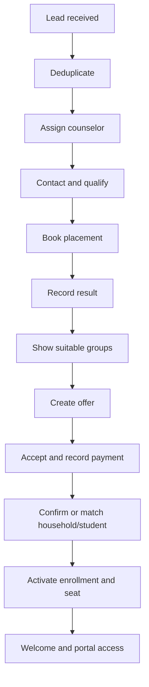
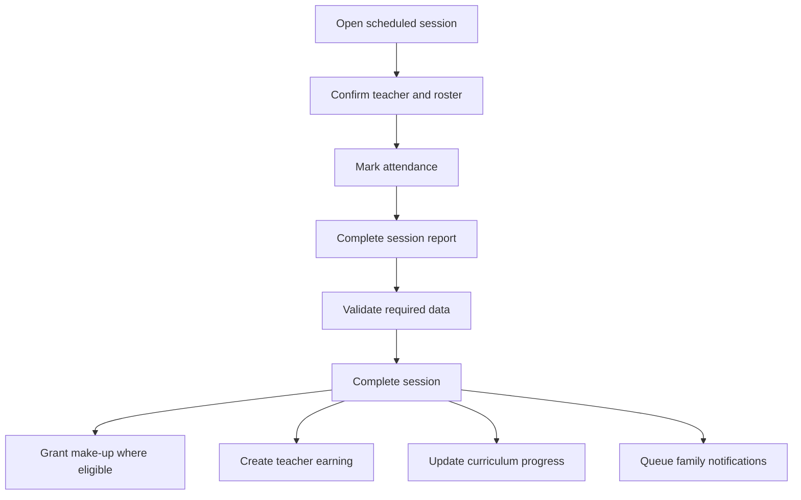
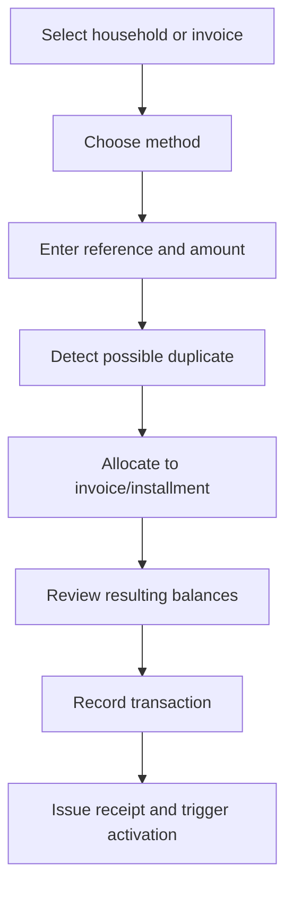

# 03 — UX and UI Blueprint

## 1. Experience vision

The product experience is defined as:

> **Calm control for staff, quick action for teachers, and visible progress for families.**

The system should feel like EduStep:

- Encouraging, not bureaucratic.
- Clear, not crowded.
- Modern, not generic ERP.
- Academic, not school-administration heavy.
- Helpful on mobile, not a desktop page squeezed into a phone.

The interface uses progressive disclosure: show the decision and next action
first, with detail one level deeper.

---

## 2. Experience principles

### Action before information

Every dashboard starts with what needs attention:

- Leads overdue.
- Sessions missing reports.
- Teacher substitution needed.
- Payments due.
- Students at risk.
- Renewals approaching.

### One timeline per relationship

Lead, household, student, teacher and group pages each include a chronological
timeline. Users should not hunt through tabs to reconstruct what happened.

### Every status explains itself

Status uses:

- Text label.
- Icon or shape.
- Color as a secondary cue.
- Reason and next action where relevant.

### Fast common work

The top 20% of tasks should require very few interactions:

- Mark group attendance.
- Add a lead follow-up.
- Book placement.
- Record payment.
- Find a student.
- Replace a teacher.
- Send a reminder.

### Exceptions are guided

Transfer, freeze, refund, make-up and manual overrides use guided steps showing:

- What will change.
- Who is affected.
- Financial effect.
- Notifications to be sent.
- Required approval.

### Arabic is not a translation layer

Arabic RTL is the primary layout:

- Direction-aware navigation.
- Logical `start` and `end` spacing.
- Arabic-friendly table alignment.
- Correct Arabic numerals and date presentation policy.
- Mixed Arabic/English content tested.
- Icons that imply direction flip correctly.

---

## 3. Primary personas and jobs

## 3.1 Owner / academy manager

Needs to know:

- Is the academy healthy today?
- Where are leads, students or money being lost?
- Which groups are full, weak or unprofitable?
- Which staff action is overdue?

Default device: desktop, with mobile summary.

## 3.2 Sales and admissions counselor

Needs to:

- Respond quickly.
- Know the lead context.
- Book assessment without schedule back-and-forth.
- Recommend a real available group.
- Follow up until payment or clear loss reason.

Default device: desktop and phone.

## 3.3 Operations coordinator

Needs to:

- See the whole schedule.
- Detect conflicts and missing teachers.
- Move sessions safely.
- Manage capacity, waitlist, transfer, freeze and make-up.

Default device: desktop.

## 3.4 Academic manager

Needs to:

- See course and group progress.
- Review assessments.
- Detect learners at risk.
- Monitor teacher quality and report completion.

Default device: desktop/tablet.

## 3.5 Finance user

Needs to:

- Collect what is due.
- Reconcile manual and gateway payments.
- Explain each balance.
- Review group margin and teacher earning.
- Close periods safely.

Default device: desktop.

## 3.6 Teacher

Needs to:

- See today, not the whole ERP.
- Open class link or location.
- Mark attendance rapidly.
- Complete a concise session report.
- Record assessment and student concern.
- Understand approved earnings.

Default device: phone.

## 3.7 Guardian

Needs to:

- See all children from one login.
- Know the next session and any change.
- Understand progress in plain language.
- Know balance and pay.
- Request support without repeating context.

Default device: phone.

---

## 4. Product surfaces

### Staff workspace

Desktop-first responsive application.

### Teacher workspace

Mobile-first route group with only teacher-relevant navigation.

### Family workspace

Mobile-first PWA with child switcher.

### Public booking

Small public flow for:

- Placement booking.
- Trial booking.
- Offer view.
- Payment handoff.

Public booking must not expose internal group data or student lists.

---

## 5. Staff information architecture

```text
الرئيسية
المبيعات والقبول
├── العملاء المحتملون
├── Pipeline
├── المهام والمتابعات
├── تقييمات المستوى
├── التجارب
└── العروض

الأشخاص
├── الأسر
├── الطلاب
├── المعلمون
└── الموظفون

التشغيل
├── الجروبات
├── التقويم
├── الحصص
├── الحضور والتعويض
└── قوائم الانتظار

الأكاديمي
├── البرامج والمستويات
├── المناهج
├── التقييمات
├── تقارير التقدم
├── الطلاب المعرضون للتعثر
└── جودة المعلمين

المالية
├── الباقات والأسعار
├── الفواتير والأقساط
├── المدفوعات والتحصيل
├── المصروفات
├── مستحقات المعلمين
└── إغلاق الفترات

التواصل والخدمة
├── الرسائل
├── الأتمتة والقوالب
├── الطلبات والشكاوى
└── الحوادث المقيدة

التقارير
الإعدادات
```

Navigation is permission-aware. Hidden modules do not leave dead links or
unauthorized dashboard cards.

---

## 6. Teacher navigation

Mobile bottom navigation:

1. **اليوم**
2. **الجدول**
3. **طلابي**
4. **المستحقات**
5. **حسابي**

Primary floating or sticky action during a live session:

**تسجيل الحضور وإكمال الحصة**

---

## 7. Family navigation

Mobile bottom navigation:

1. **الرئيسية**
2. **الجدول**
3. **التقدم**
4. **المدفوعات**
5. **المساعدة**

The selected child remains visible in the page header. Switching child never
loses the current top-level section.

---

## 8. Screen inventory

## 8.1 Staff routes

| Route | Screen | Release |
|---|---|---|
| `/dashboard` | Owner/role dashboard | MVP |
| `/crm/leads` | Lead list | MVP |
| `/crm/pipeline` | Lead Kanban | MVP |
| `/crm/leads/[id]` | Lead 360 | MVP |
| `/crm/tasks` | Follow-up inbox | MVP |
| `/admissions/placements` | Placement calendar/list | v1 |
| `/admissions/placements/[id]` | Placement form/result | v1 |
| `/admissions/trials` | Trials | v1 |
| `/admissions/offers/[id]` | Offer builder | v1 |
| `/people/households` | Households | MVP |
| `/people/households/[id]` | Family 360 | MVP |
| `/people/students` | Students | MVP |
| `/people/students/[id]` | Student 360 | MVP |
| `/people/teachers` | Teachers | MVP |
| `/people/teachers/[id]` | Teacher 360 | MVP |
| `/operations/groups` | Groups | MVP |
| `/operations/groups/[id]` | Group 360 | MVP |
| `/operations/calendar` | Master calendar | MVP |
| `/operations/sessions/[id]` | Session register | MVP |
| `/academics/catalog` | Programs/levels/curriculum | MVP |
| `/academics/assessments` | Assessment work queue | v1 |
| `/academics/progress` | Risk and progress view | v1 |
| `/finance/invoices` | Invoice list | MVP |
| `/finance/invoices/[id]` | Invoice detail | MVP |
| `/finance/payments` | Payments/reconciliation | MVP |
| `/finance/collections` | Collection work queue | v1 |
| `/finance/payroll` | Payroll periods | v1 |
| `/finance/expenses` | Expenses | v1 |
| `/support/requests` | Requests and complaints | v1 |
| `/reports` | Report catalog | v1 |
| `/settings/*` | Settings and access | MVP |

## 8.2 Teacher routes

| Route | Screen |
|---|---|
| `/teacher/today` | Today timeline and urgent actions |
| `/teacher/schedule` | Week schedule |
| `/teacher/sessions/[id]` | Session detail and attendance |
| `/teacher/students/[id]` | Assigned learner summary |
| `/teacher/assessments` | Assessment tasks |
| `/teacher/earnings` | Approved and pending earning |
| `/teacher/profile` | Availability, documents and account |

## 8.3 Family routes

| Route | Screen |
|---|---|
| `/family/home` | Next session, action cards and child summary |
| `/family/schedule` | Child schedule |
| `/family/progress` | Skills and report cards |
| `/family/attendance` | Attendance and make-up balance |
| `/family/billing` | Invoices, installments and receipts |
| `/family/requests` | Support requests |
| `/family/profile` | Household and communication preferences |

---

## 9. Key screen specifications

## 9.1 Role dashboard

### Purpose

Answer “what needs my decision today?” in under 30 seconds.

### Layout

```text
┌─────────────────────────────────────────────────────────────┐
│ greeting + date       global search        quick create     │
├─────────────────────────────────────────────────────────────┤
│ Needs attention: overdue leads | missing reports | due cash │
├─────────────────────────────────────────────────────────────┤
│ KPI trend cards: leads | conversion | attendance | collect. │
├────────────────────────────────┬────────────────────────────┤
│ Today timeline                 │ Action queue               │
│ placements, sessions, changes  │ owned overdue work         │
├────────────────────────────────┴────────────────────────────┤
│ Funnel / occupancy / collection trend based on permission   │
└─────────────────────────────────────────────────────────────┘
```

Rules:

- No more than six KPI cards.
- Every KPI is clickable to its filtered list.
- Trends show comparison period and metric definition.
- Empty states explain the next useful action.
- Finance data is omitted entirely for unauthorized roles.

## 9.2 Lead pipeline

Views:

- Kanban for stage movement.
- List for filtering and bulk ownership.
- My follow-ups for action.

Lead card shows:

- Contact and learner name.
- Age/goal.
- Source.
- Last interaction.
- Next action.
- Owner.
- SLA warning.

Dragging stage opens a lightweight transition form only when the destination
requires additional information, such as lost reason.

## 9.3 Lead 360

Header:

- Contact.
- Stage.
- Owner.
- Next action.
- Call/WhatsApp actions.

Body:

- Left/main: activity timeline and composer.
- Right/summary: prospective learners, preferences, source and fit.
- Tabs: overview, appointments, offers, files.

Sticky next-action control prevents an active lead being saved without follow-up.

## 9.4 Placement workspace

Calendar and queue:

- Today and upcoming.
- Confirmed/no confirmation.
- Assessor availability.
- No-show quick reschedule.

Assessment form:

- One skill section at a time.
- Rubric descriptions visible.
- Autosave draft.
- Internal note separated from parent summary.
- Recommended level and suitable groups side panel.
- Completion preview before publish.

## 9.5 Student 360

Header:

- Student identity and status.
- Current level and group.
- Attendance indicator.
- Balance warning only to authorized roles.
- Risk and next action.

Tabs:

- Overview.
- Timeline.
- Enrollments.
- Attendance.
- Progress.
- Billing.
- Documents.
- Requests.

The overview shows recent progress in “can do” language, not a dense gradebook.

## 9.6 Teacher 360

Header:

- Status and availability.
- Current groups and weekly load.
- Missing documents.
- Quality/reliability indicators.

Tabs:

- Profile and qualification.
- Schedule and availability.
- Groups.
- Observations.
- Session report completion.
- Rates and earnings, permission-controlled.
- Documents.

## 9.7 Master calendar

Views:

- Day.
- Week.
- Teacher lanes.
- Room lanes.
- Group filter.

Interaction:

- Drag/drop is allowed only with confirmation preview.
- Resize changes duration with warning.
- Conflict appears before save.
- Change preview lists people and notifications affected.
- Past locked sessions cannot move.
- Mobile uses agenda view, not a compressed week grid.

## 9.8 Group 360

Top:

- Group name, level, teacher, schedule and capacity.
- Occupancy and waitlist.
- Curriculum progress.
- Attendance.
- Collection and margin only to authorized roles.

Tabs:

- Roster.
- Sessions.
- Progress.
- Attendance.
- Financial.
- Timeline.

Primary actions:

- Add/enroll learner.
- Generate or adjust sessions.
- Assign substitute.
- Transfer learner.
- Message group.
- Complete/end group.

## 9.9 Session register

Teacher mobile flow:

1. Open today.
2. Select session.
3. All students default to expected, not automatically present.
4. Mark status using large touch targets.
5. Add arrival or reason only when needed.
6. Complete short session report.
7. Review effects and submit.

Targets:

- Typical group attendance in under 60 seconds.
- Save draft if connectivity is interrupted.
- Prevent accidental double submission.
- Show exactly what remains incomplete.

## 9.10 Finance center

The finance home is a work queue, not just charts:

- Due today.
- Overdue by aging.
- Payment proofs awaiting verification.
- Failed gateway events.
- Refund/discount approvals.
- Payroll periods awaiting review.

Invoice detail shows a human-readable ledger:

- Original amount.
- Discounts.
- Installments.
- Payments and allocations.
- Credits/refunds.
- Remaining balance.

No user should need to calculate the balance manually.

## 9.11 Academic progress

Views:

- Student skills.
- Group heatmap.
- Assessments due.
- At-risk work queue.
- Level completion decision.

Charts do not hide evidence. Selecting a skill reveals:

- Assessment points.
- Teacher observations.
- Attendance context.
- Recommended intervention.

## 9.12 Family home

Priority order:

1. Next session and join/location action.
2. Urgent change or payment action.
3. Progress highlight.
4. Recent attendance/session summary.
5. Upcoming payment.
6. Help request.

Copy uses simple Egyptian-friendly Arabic while remaining professional.

---

## 10. Core user flows

## 10.1 Lead to enrollment



Failure states:

- Duplicate lead.
- No suitable group.
- Assessment no-show.
- Offer expiry.
- Partial payment.
- Seat filled before payment.

Every failure state has a recovery path.

## 10.2 Session completion



## 10.3 Payment recording



## 10.4 Student transfer

Wizard steps:

1. Source enrollment and effective date.
2. Compatible target groups and real capacity.
3. Academic progress mapping.
4. Schedule conflict check.
5. Financial credit/charge effect.
6. Make-up and freeze effect.
7. Notification preview.
8. Confirm with reason.

---

## 11. Design language

### Working concept

**Visible Progress, Calm Operations**

The visual language uses EduStep’s progress theme in restrained ways:

- Rounded cards inspired by the logo.
- Small progress lines and milestone dots.
- Teal for action and progress.
- Yellow for achievement and carefully limited attention.
- Navy for navigation, headings and trust.
- White and mist backgrounds for operational clarity.

Avoid:

- Childish illustrations inside staff tools.
- Heavy gradients and glass effects.
- Excessive dashboard cards.
- Teal text on white at small sizes.
- Color-only statuses.
- Decorative motion during repetitive admin work.

### Color tokens

| Token | Value | Use |
|---|---:|---|
| `--brand-navy` | `#0B2454` | Navigation, headings, primary strong actions |
| `--brand-teal` | `#0BA7B4` | Progress, links, selected states |
| `--brand-sun` | `#FFB703` | Achievement and limited warnings |
| `--ink` | `#152238` | Body text |
| `--slate` | `#53627A` | Secondary text |
| `--mist` | `#E9F8FA` | Soft surfaces |
| `--cloud` | `#F7FAFC` | Application background |
| `--danger` | to be contrast-tested | Destructive/error only |
| `--success` | to be contrast-tested | Success with icon/text |

Semantic colors are derived and contrast-tested; brand teal is not forced into
every semantic role.

### Typography

- Arabic: Alexandria.
- English/numerals: Manrope.
- Tabular numbers for finance and dense metrics.
- Minimum comfortable body size: 14px staff dense tables, 16px mobile.
- Headings remain short.

### Shape and spacing

- Base spacing unit: 4px.
- Common gaps: 8, 12, 16, 24, 32.
- Card radius: 16px.
- Input/button radius: 10–12px.
- Minimum touch target: 44px.
- Table row density: comfortable by default, compact optional for staff.

### Elevation

- Borders separate most surfaces.
- Shadows are subtle and reserved for floating layers.
- Dialog and popover focus is obvious.

---

## 12. Component system

Foundations:

- Tailwind CSS design tokens.
- Owned shadcn components.
- Radix primitives for accessibility and behavior.
- Logical direction utilities for RTL/LTR.

Core components:

- App shell.
- Sidebar and mobile bottom navigation.
- Page header.
- Breadcrumbs.
- Global search/command menu.
- KPI card.
- Action queue item.
- Data table.
- Filter bar.
- Status badge.
- Timeline.
- Activity composer.
- Person and group picker.
- Currency input.
- Phone input.
- Date/time and recurrence controls.
- Form section and sticky form actions.
- Permission-aware action menu.
- Empty state.
- Inline alert.
- Confirmation and impact dialog.
- Stepper/wizard.
- Attendance roster.
- Skill rubric.
- Payment allocation.
- Audit history drawer.

Each component has:

- Default, hover, focus, disabled, loading, error and empty states.
- RTL and LTR story.
- Keyboard behavior.
- Accessible label guidance.
- Mobile behavior.

---

## 13. Forms

Rules:

- Short forms open inline or in a drawer.
- Long forms use dedicated pages.
- Sections are grouped by user decision, not database table.
- Required fields are limited to operational necessity.
- Validation appears next to the field and in a summary on submit.
- Draft autosave is used for long assessments and reports.
- Unsaved changes protection is enabled.
- Destructive actions require impact and reason, not a generic “Are you sure?”.
- Entered phone and money values are formatted without changing meaning.
- Selects with many people use searchable async comboboxes.

---

## 14. Tables and lists

Every operational list supports:

- Search.
- Named filters.
- Saved personal view later if needed.
- Column visibility.
- Sort.
- Pagination.
- Bulk selection only for safe actions.
- Export only with permission.
- Empty, loading and error states.

Mobile lists become cards with the same priority information; horizontal table
scroll is a last resort.

---

## 15. Feedback and motion

- Optimistic UI only for easily reversible, low-risk actions.
- Financial and enrollment actions wait for server confirmation.
- Toasts confirm minor actions.
- Persistent inline banners explain actions needing attention.
- Long jobs show queued/processing/completed state and remain discoverable.
- Skeletons match final layout.
- Motion uses reduced-motion preference.
- Success animation is brief and limited to meaningful milestones.

---

## 16. Accessibility requirements

Target WCAG 2.2 AA for core flows:

- Keyboard-complete navigation.
- Visible focus.
- Labels and error association.
- Dialog focus trap and return.
- Screen-reader status announcements.
- Contrast validation.
- Zoom and text resizing.
- No color-only meaning.
- Arabic screen-reader labels reviewed.
- Charts accompanied by text/table summary.
- Touch targets at least 44px.

Automated checks are necessary but do not replace manual keyboard and screen
reader checks.

---

## 17. UX performance targets

- Staff app useful content visible quickly on normal Egyptian mobile networks.
- Route transitions preserve shell and filters.
- Common lists show skeleton then first page, not a blocking blank screen.
- Search starts after sensible debounce and cancels stale requests.
- Calendar fetches only the visible range.
- Large exports run asynchronously.
- Uploaded files show progress and recoverable failure.

Measured targets are finalized after a staging baseline.

---

## 18. Usability acceptance targets

During pilot testing:

- A teacher marks a normal group attendance in under 60 seconds.
- A counselor finds or creates a lead and schedules follow-up in under 90 seconds.
- A counselor books placement without opening another calendar.
- Operations identifies schedule conflicts before save.
- Finance can explain an account balance from the transaction timeline.
- A guardian finds the next session in one screen.
- A guardian switches children without logging out.
- A manager reaches every dashboard metric’s supporting list in one click.
- No core flow depends on hidden hover-only controls.

---

## 19. Design process gate

Before frontend feature implementation:

1. Approve information architecture.
2. Approve brand token direction.
3. Create low-fidelity wireframes for the golden path.
4. Build interactive prototype for:
   - Lead 360.
   - Placement.
   - Group/session attendance.
   - Student 360.
   - Payment recording.
   - Family home.
5. Test with representative users.
6. Resolve critical usability findings.
7. Freeze v1 component foundations.

