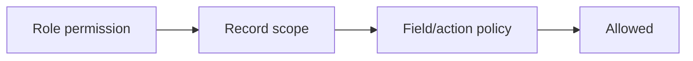

# 05 — RBAC, Security and Non-Functional Requirements

## 1. Security posture

EduStep stores children’s information, family contact data, teacher documents
and financial records. Security is a product requirement, not a deployment task.

The implementation uses:

- Laravel authentication and policies.
- Sanctum first-party session protection.
- Role and permission mapping.
- Record/branch scope checks.
- Field visibility rules.
- Privileged-action re-authentication.
- Audit trails.
- OWASP ASVS 5.0 as the verification baseline for relevant controls.

---

## 2. Authorization model

Authorization is evaluated in three layers:



Example:

1. Teacher has `students.view_assigned`.
2. Student is in a group assigned to that teacher.
3. The requested field is teacher-visible.
4. Access is allowed.

Frontend hiding is usability only. Laravel performs the authoritative check.

---

## 3. Roles

Initial roles:

- `owner`
- `academy_manager`
- `sales_admissions`
- `customer_success`
- `academic_manager`
- `operations_coordinator`
- `finance`
- `teacher`
- `guardian`
- `student`
- `support_admin` only if operationally needed

Roles are composable for staff. Guardian/student roles are linked to their
person records and cannot be combined with staff without explicit owner review.

---

## 4. Permission naming

Permission keys use:

```text
resource.action.scope
```

Examples:

- `leads.view.all`
- `leads.view.owned`
- `leads.assign`
- `students.view.branch`
- `students.view.assigned`
- `sessions.complete.assigned`
- `payments.record`
- `payments.verify`
- `refunds.approve`
- `payroll.lock`
- `audit.export`

Permissions represent meaningful capabilities, not individual buttons.

---

## 5. Permission matrix

Legend:

- **A** all permitted records
- **B** branch-scoped
- **O** owned/assigned only
- **S** self/family only
- **—** no access
- **Approval** can request but needs another authorized user

| Capability | Owner | Manager | Sales | Success | Academic | Operations | Finance | Teacher | Guardian |
|---|---:|---:|---:|---:|---:|---:|---:|---:|---:|
| View leads | A | B | O/B | O/B | — | Limited | Finance link only | — | — |
| Create/update leads | A | B | O/B | O/B | — | — | — | — | — |
| Assign leads | A | B | Limited | — | — | — | — | — | — |
| Convert lead | A | B | O/B | Limited | — | — | Record payment only | — | — |
| View households | A | B | B limited | B | Academic limited | B | B financial | Assigned limited | S |
| View students | A | B | B limited | B | B | B | Financial limited | O | S |
| Edit student identity | A | B | During conversion | B limited | Academic fields | B limited | Billing fields | — | Own contact request |
| View teacher profile | A | B | — | — | B | B | Payment fields | Self | — |
| View teacher rates | A | B limited | — | — | — | — | B | Self current | — |
| Manage groups | A | B | Read availability | Read | Academic parts | B | Financial read | O read | S read |
| Manage sessions | A | B | Read trial | Read | B | B | Locked read | O | S read |
| Record attendance | A | B | Trial only | Exception | B | B | — | O | — |
| Publish assessments | A | B | — | Read | B | — | — | Draft O | Published S |
| Create invoice | A | B | Offer-related | — | — | — | B | — | — |
| Record payment | A | Approval | — | — | — | — | B | — | External/self |
| Verify manual payment | A | Approval | — | — | — | — | B | — | — |
| Approve refund | A | Policy limit | — | — | — | — | Request/limit | — | Request |
| View group margin | A | B | — | — | — | — | B | — | — |
| Review payroll | A | B limited | — | — | Evidence only | — | B | Self | — |
| Lock payroll | A | Approval | — | — | — | — | Approval | — | — |
| View audit | A | B relevant | Own actions | Own actions | Relevant | Relevant | Relevant | Own | Own timeline |
| Export data | A | Permission | Permission limited | Permission limited | Permission | Permission | Permission | — | Own documents |

The final matrix is converted to machine-readable seed configuration and
feature tests.

---

## 6. Record scopes

### Branch

Staff queries are constrained by explicit branch scope. “All branches” is a
permission, not a missing filter.

### Owner

CRM counselors see owned leads by default. Managers may see branch leads.

### Teacher assignment

Teacher access derives from:

- Active group assignment.
- Session substitute assignment.
- Explicit temporary academic review assignment.

Access expires when the assignment ends, except minimal historical self-records
such as their own submitted session report.

### Family

Guardian access derives from active guardian-student relationship. It does not
depend on a client-supplied student id alone.

### Student

Student access is age/policy appropriate and never includes household finance
unless explicitly allowed for an adult learner.

---

## 7. Field visibility

Sensitive fields are placed in dedicated resources or filtered serializers.

| Field class | Visible to |
|---|---|
| Basic student profile | Authorized staff, assigned teacher, own guardian |
| Restricted learning/health note | Named academic/management roles only |
| Guardian contact | Staff by need; teacher only if policy permits |
| Teacher identity documents | Owner/authorized HR/manager |
| Teacher rate/bank data | Owner, finance, teacher self |
| Household ledger | Owner, finance, guardian self; limited sales state |
| Internal complaint notes | Assigned support/management |
| Safeguarding incident | Explicit restricted group only |
| Audit details | Owner and relevant privileged reviewers |

“Internal”, “academic”, “financial” and “parent-visible” notes are separate
types. A visibility toggle is not used to repurpose the same text accidentally.

---

## 8. Approval controls

Dual control is applied to:

- Refund above configured threshold.
- Manual payment verification above threshold.
- Large discount.
- Payroll approval/locking.
- Unlocking a financial period.
- Export of broad child/family data.
- Role escalation.
- Deletion/anonymization request execution.

An approver cannot approve their own request where separation of duties applies.

---

## 9. Authentication requirements

- Password minimum and breach-resistant policy.
- Secure password hashing using Laravel-supported algorithms.
- Login throttling by account and IP.
- Password reset tokens expire and are single-use.
- Session id rotates on authentication.
- Sensitive action may require recent password/2FA confirmation.
- 2FA mandatory for owner and finance at production launch.
- Staff session inactivity timeout.
- Guardian session duration balanced for mobile usability.
- Suspended user sessions revoked.
- User can see and revoke their other sessions.
- Authentication events logged without recording secrets.

---

## 10. Application security controls

### Input and output

- All requests validated.
- Parameterized database access through Laravel query facilities.
- Output encoded by React.
- Rich text, if later enabled, uses a strict sanitizer and allowlist.
- Uploaded filenames are not trusted.

### CSRF and browser

- Sanctum CSRF protection.
- Same-origin routing.
- Content Security Policy introduced in report-only mode, then enforced.
- Secure response headers.
- Frame protection.
- Strict referrer policy.
- CORS deny-by-default.

### Secrets

- Secrets are injected at runtime.
- No credentials in git, logs, screenshots or demo data.
- Separate credentials by environment.
- Key rotation procedure documented.
- Provider tokens encrypted where they must be stored.

### Dependencies

- Lockfiles committed.
- Automated dependency and vulnerability review.
- Unsupported runtimes rejected.
- Software bill of materials generated for releases when CI is established.

---

## 11. Audit requirements

Audit records cover:

- Login/security events.
- Role and permission changes.
- Lead assignment and stage transitions.
- Lead merge and conversion.
- Student/guardian relationship changes.
- Enrollment state and price changes.
- Session reschedule/cancel/reopen.
- Attendance correction.
- Assessment publish/correction.
- Invoice issue/void.
- Payment record/verify/allocate/refund.
- Expense and payroll approvals.
- Export/download of broad data.
- Restricted incident access where appropriate.

Audit displays:

- Who.
- When.
- What changed.
- From/to state.
- Why/override reason.
- Request id.

Sensitive values such as passwords, tokens, complete bank details and protected
notes are never copied into the audit diff.

---

## 12. Privacy and child-data controls

- Collect only data tied to a defined operational purpose.
- Record guardian consent and policy version where required.
- Separate marketing consent from service communication.
- Limit staff access to need.
- Signed/private file access.
- Export and correction workflow.
- Retention schedule by record class.
- Development uses synthetic data.
- Analytics avoid unnecessary personally identifiable information.
- Restricted incidents are excluded from general search and dashboards.
- Public URLs do not expose sequential ids or names.

Legal retention and consent wording are reviewed with appropriate Egyptian legal
and accounting professionals before production; the software does not invent
legal policy.

---

## 13. Non-functional requirements

## 13.1 Availability

Pilot target:

- Application designed for 99.9% monthly availability after stabilization.
- Planned maintenance communicated.
- External notification failure does not stop internal record creation.
- Queue and provider degradation is visible.

## 13.2 Performance

Initial product targets measured at p95:

- Normal API reads under 500 ms excluding network.
- Normal mutations under 800 ms excluding queued work.
- Search first page under 700 ms.
- Dashboard first useful data under 2 seconds on representative connection.
- Attendance save under 1 second.
- Long exports and PDFs always asynchronous.

Targets are validated and adjusted with staging load data.

## 13.3 Scale assumptions

Architecture comfortably targets:

- Tens of staff concurrent users.
- Hundreds to low thousands of active learners.
- Hundreds of sessions per day.
- High notification bursts around session times.

Scale tests use higher safety margins. Microservices are not required for this
load profile.

## 13.4 Recovery

Proposed starting objectives:

- RPO: 15 minutes or better for production database where hosting supports PITR.
- RTO: 4 hours for a severe production incident.
- Daily backups plus point-in-time recovery.
- Restore test at least quarterly and before major infrastructure change.

These become contractual only after hosting is chosen.

## 13.5 Compatibility

- Current modern Chrome, Edge, Firefox and Safari supported by the chosen Next.js version.
- Responsive from 360px width.
- Teacher/family core flows tested on common Android devices and iPhone Safari.
- No core operation requires hover.

## 13.6 Localization

- Arabic default, English-ready.
- Africa/Cairo dates.
- EGP default.
- Translation keys, not hard-coded bilingual strings.
- Mixed-direction content tested.
- Templates versioned per language.

---

## 14. Threat scenarios to test

- Counselor changes URL to view another branch’s lead.
- Teacher requests a non-assigned student id.
- Guardian changes child id.
- Replayed payment webhook.
- Duplicate manual payment submission.
- Cross-site form attempts state mutation.
- Stolen integration token.
- Malicious file upload.
- Spreadsheet formula injection in export.
- CSV import with invalid or duplicate phone data.
- Privileged user exports all children without approval.
- Old staff session remains active after suspension.
- Queue retries send duplicate receipt.
- Race condition fills the final group seat twice.
- Payroll is changed after locking.

Each scenario maps to automated or documented manual verification.

---

## 15. Security release gate

Before pilot:

- Permission matrix tests pass.
- Cross-branch, teacher and family isolation tests pass.
- 2FA enabled for privileged accounts.
- Secure cookie and CSRF configuration verified.
- Rate limits verified.
- File access and upload validation verified.
- Webhook signature and replay tests pass.
- Financial idempotency tests pass.
- Dependency scan reviewed.
- Backup restore performed.
- Logs confirmed free of protected fields.
- ASVS-based review completed for the agreed level.

References:

- [OWASP ASVS](https://owasp.org/www-project-application-security-verification-standard/)
- [Laravel authentication](https://laravel.com/docs/13.x/authentication)
- [Laravel Sanctum](https://laravel.com/docs/13.x/sanctum)
- [Laravel CSRF protection](https://laravel.com/docs/13.x/csrf)
- [Laravel authorization](https://laravel.com/docs/13.x/authorization)

