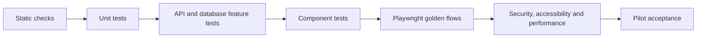

# 07 — Quality, DevOps and Release Plan

## 1. Quality strategy

Quality is built into every vertical slice. The project does not wait for a
final manual test phase.

---

## 2. Backend testing

### Unit tests

Focus on pure rules:

- Money calculations.
- Discount rules.
- Make-up eligibility.
- Teacher rate resolution.
- Risk thresholds.
- State-transition rules.
- Date/recurrence helpers.

### Feature/API tests

Cover:

- Request validation.
- Authentication.
- Permissions and row scope.
- Database writes and constraints.
- State transitions.
- Audit records.
- Outbox creation.
- Error codes.
- Idempotency.
- Optimistic concurrency.

### Integration tests

Cover:

- PostgreSQL-specific behavior.
- Redis locks and queues.
- Object-storage signing through a test adapter.
- Provider adapters with recorded/sandbox responses.
- Webhook signatures and replay.

Tests use PostgreSQL, not SQLite, where database behavior matters.

---

## 3. Frontend testing

### Static checks

- TypeScript strict.
- ESLint.
- Formatting.
- Unused code/import detection.
- Generated API contract freshness.

### Component tests

Cover behavior of:

- Forms and validation.
- Permission-aware actions.
- Data tables and filters.
- Attendance roster.
- Payment allocation.
- Dialog impact preview.
- RTL navigation.

### Visual states

Core components are reviewed in:

- Arabic RTL.
- English LTR.
- Mobile and desktop widths.
- Loading.
- Empty.
- Error.
- Long content.
- Keyboard focus.

### End-to-end

Playwright tests user-visible behavior and keeps tests isolated. Critical suites:

- Authentication and authorization.
- Lead to conversion.
- Placement.
- Group/session creation.
- Teacher attendance/report.
- Payment and activation.
- Guardian isolation and child switcher.
- Refund and payroll permission controls.

---

## 4. Test data

- Factories create deterministic realistic data.
- Test users exist for every role.
- Golden-flow identifiers are stable within test setup.
- Provider calls are mocked except scheduled sandbox suites.
- Time is frozen where due dates and reminders matter.
- Production data is never copied into tests.
- Arabic names, mixed text and Egyptian phone formats are included.

---

## 5. Quality gates in CI

Pull request pipeline:

1. Validate repository configuration.
2. PHP dependency install from lockfile.
3. Laravel Pint/lint/static analysis.
4. Laravel unit and feature tests.
5. Node dependency install from lockfile.
6. TypeScript and lint.
7. Frontend component tests.
8. Next.js production build.
9. OpenAPI validation and generated-client diff.
10. Database migration from empty database.
11. Database migration from previous release snapshot for release candidates.
12. Playwright smoke suite against composed application.
13. Dependency/security scan.

Main/staging pipeline adds:

- Full Playwright suite.
- Accessibility scan.
- Container image build.
- Staging deployment.
- Post-deploy smoke.

---

## 6. Branch and review model

- Protected `main`.
- Short-lived feature branches.
- Pull request required.
- At least one review for code.
- Finance/security/high-risk changes require domain-aware reviewer.
- No direct production hotfix without incident record and follow-up PR.
- Database migrations reviewed for lock and rollback/forward strategy.

Commit and pull-request templates reference:

- Story id.
- User impact.
- Test evidence.
- Migration impact.
- Screenshot for UI.
- Security/permission considerations.

---

## 7. Environments

## Local

- Docker Compose.
- Synthetic seed data.
- Local mail catcher.
- Fake/provider adapters.
- Object-storage emulator or development bucket.

## Staging

- Production-like topology.
- Synthetic or explicitly sanitized data.
- Provider sandboxes.
- Full queue/scheduler.
- Used for UX acceptance, migration rehearsal and load tests.

## Production

- Isolated credentials and data.
- TLS.
- Managed database preferred.
- Redis with persistence/HA appropriate to hosting.
- Private object storage.
- Separate web, API and worker processes.
- Monitoring and backups.

No production secrets are available to preview deployments.

---

## 8. Deployment sequence

1. Build immutable Laravel and Next.js artifacts/images.
2. Run automated checks.
3. Apply backward-compatible database migration.
4. Deploy API/web.
5. Restart queue workers gracefully.
6. Verify scheduler ownership.
7. Run health and smoke checks.
8. Monitor error/latency/queue dashboards.
9. Enable feature flag for pilot users.

Use expand/contract migrations:

- Add new nullable/backfilled field.
- Deploy code supporting old and new.
- Backfill asynchronously.
- Switch reads/writes.
- Remove old field in a later release.

Production rollback is primarily application rollback plus forward database
repair; destructive migration rollback is not assumed safe.

---

## 9. Health checks

### Liveness

- Process responds.

### Readiness

- Required configuration loaded.
- Database reachable.
- Redis reachable where required.
- Build/version available.

External WhatsApp/payment failure does not make the whole API unready, but it
appears in dependency health and alerts.

---

## 10. Monitoring and alerts

### Application

- Error rate.
- p95/p99 latency.
- Slow endpoints.
- Database connections and slow queries.
- Queue depth and wait.
- Failed jobs.
- Scheduler missed heartbeat.

### Business/operational

- Lead webhook not received in expected window.
- Payment callback failures.
- Notification delivery drop.
- Duplicate-prevention conflict spike.
- Sessions missing attendance/report.
- Import row failure rate.

### Infrastructure

- CPU/memory/disk.
- Database storage and replication/PITR status.
- Redis memory and evictions.
- Backup age.
- Certificate expiration.

Alerts have severity, owner and runbook. Alerting on every exception without
actionability is avoided.

---

## 11. Backup and disaster recovery

### Backup

- Managed PostgreSQL point-in-time recovery where available.
- Daily database snapshot.
- Object storage versioning/lifecycle.
- Configuration and infrastructure stored in version control.
- Secrets backed up through the chosen secret manager process.

### Restore test

1. Restore database to isolated environment.
2. Restore/link object storage snapshot.
3. Start matching application version.
4. Run data integrity checks.
5. Run golden-path read smoke.
6. Record actual RPO/RTO.
7. Resolve gaps.

Restore evidence is required before pilot go-live.

---

## 12. Data migration

Migration workflow:

1. Collect sample sheets/forms.
2. Define canonical import template.
3. Normalize phone, dates, statuses and money.
4. Dry-run validation with row-level errors.
5. Deduplication review.
6. Import households/guardians.
7. Import students/teachers.
8. Import programs/groups/enrollments.
9. Import opening invoice/payment balances with explicit migration source.
10. Reconcile counts and totals.
11. Business owner signs off.
12. Final cutover import.

Every imported row retains:

- Import batch.
- Source row.
- Mapping result.
- Error/warning.
- Created/matched record.

Opening balances never masquerade as fully detailed historical transactions.

---

## 13. Performance validation

Scenarios:

- Lead list with realistic historical volume.
- Global phone/name search.
- Calendar visible week.
- Group attendance submit.
- Household ledger.
- Finance aging dashboard.
- Concurrent final-seat enrollment.
- Notification burst before sessions.
- Large import.
- Report export.

Test with representative latency and mobile device throttling, not localhost only.

---

## 14. Accessibility and usability validation

Before pilot:

- Automated accessibility checks on core routes.
- Manual keyboard pass.
- Focus and dialog pass.
- Zoom/text size pass.
- RTL/mixed-direction pass.
- Screen-reader spot check.
- Android Chrome and iPhone Safari checks.
- Teacher attendance usability test.
- Counselor lead workflow test.
- Guardian child-switching and billing test.

Critical usability failure blocks release like a functional defect.

---

## 15. Pilot plan

### Scope

- One program.
- Limited number of groups.
- Representative teachers.
- Small staff group.
- Selected families after staff workflows stabilize.

### Parallel period

- Short, explicitly time-boxed comparison with existing records.
- Define which system is authoritative for each data type.
- Daily reconciliation.
- No indefinite double entry.

### Pilot success

- 95%+ pilot sessions recorded in EduStep.
- No active pilot lead lacks next action due to system failure.
- Invoice/payment totals reconcile.
- Teacher earnings reconcile.
- No cross-family or cross-teacher data exposure.
- Common tasks meet usability targets.
- Restore and support process proven.

Targets may be adjusted during Sprint 0 with baseline evidence.

---

## 16. Go/no-go checklist

### Product

- Golden path accepted.
- Policies configured.
- Required reports reconcile.
- Training complete.

### Data

- Import signed off.
- Counts and financial opening balances reconciled.
- Duplicate review complete.

### Security

- Role tests pass.
- 2FA privileged users.
- Provider secrets configured.
- Audit and file access verified.

### Operations

- Monitoring and alerts active.
- Backup and restore proven.
- Queue/scheduler runbooks ready.
- Support owner and escalation known.

### Release

- Staging release candidate stable.
- Migration rehearsal complete.
- Rollback/forward plan ready.
- Go-live window and communications agreed.

---

## 17. Post-launch

First two weeks:

- Daily product/operations triage.
- Review failed jobs and integrations.
- Review data quality.
- Monitor task completion and spreadsheet fallback.
- Fix critical friction before adding scope.

After stabilization:

- Compare baseline KPIs.
- Prioritize P2 backlog by evidence.
- Decide WhatsApp, gateway and accounting depth.
- Decide whether native apps or LMS capability are actually necessary.

References:

- [Playwright test isolation and user-visible testing](https://playwright.dev/docs/best-practices)
- [Next.js testing guides](https://nextjs.org/docs/app/guides/testing)
- [Laravel testing](https://laravel.com/docs/13.x/testing)
- [Laravel queues](https://laravel.com/docs/13.x/queues)

