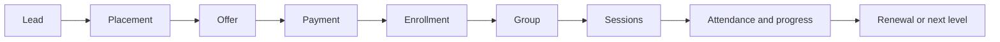

# EduStep Academy OS — Execution Blueprint

**Status:** Ready for review before implementation  
**Prepared:** 26 July 2026  
**Product:** Internal academy operations platform  
**Backend:** Laravel 13 / PHP 8.4  
**Frontend:** Next.js App Router / TypeScript / Node.js 24 LTS  
**Data:** PostgreSQL 18 / Redis / S3-compatible object storage  
**Default locale:** Arabic RTL  
**Default timezone:** Africa/Cairo  
**Default currency:** EGP

---

## 1. Purpose

This package turns the product plan in
[`EDUSTEP-ACADEMY-OS-PLAN-AR.md`](../EDUSTEP-ACADEMY-OS-PLAN-AR.md)
into an implementation-ready blueprint.

It answers:

- What gets built first?
- How will Laravel and Next.js be separated?
- What are the system modules and ownership boundaries?
- What data must be stored and what rules protect it?
- What screens and user flows are required?
- How will permissions, payments, queues, integrations, and audit work?
- How will each release be tested and accepted?
- What decisions remain configurable without blocking the start?

This is the planning gate. Application scaffolding begins only after the
decisions marked **blocking before Sprint 1** are confirmed.

---

## 2. Blueprint documents

| Document | Purpose |
|---|---|
| [00 — الملخص التنفيذي بالعربية](00-EXECUTIVE-SUMMARY-AR.md) | القرارات الأساسية، مراحل التنفيذ، الأولويات وما يلزم اعتماده قبل البرمجة |
| [01 — Technical Architecture](01-TECHNICAL-ARCHITECTURE.md) | Stack, repository, runtime, backend/frontend structure, transactions, events, caching, files and deployment topology |
| [02 — Domain & Data Model](02-DOMAIN-DATA-ERD.md) | Bounded contexts, entities, relationships, invariants, identifiers, money and time rules |
| [03 — UX/UI Blueprint](03-UX-UI-BLUEPRINT.md) | Personas, information architecture, navigation, screen specifications, RTL design system and usability targets |
| [04 — API & Integrations](04-API-INTEGRATIONS.md) | REST conventions, endpoint map, errors, pagination, idempotency, webhooks and external services |
| [05 — RBAC, Security & NFR](05-RBAC-SECURITY-NFR.md) | Permission matrix, row-level scope, audit, privacy, availability, performance and recovery |
| [06 — Roadmap & Backlog](06-ROADMAP-BACKLOG.md) | Epics, user stories, acceptance gates, sprint sequence, pilot and release scope |
| [07 — Quality, DevOps & Release](07-QUALITY-DEVOPS-RELEASE.md) | Test pyramid, CI/CD, environments, monitoring, backups, migration and launch checklist |
| [08 — Decision Register](08-DECISION-REGISTER.md) | Resolved architectural decisions, business decisions still needed and safe defaults |

---

## 3. Product definition

EduStep Academy OS is not a generic school ERP and not a content-first LMS.
It is the operational source of truth for:



The system has three experiences:

1. **Staff workspace:** sales, admissions, operations, academics, finance and management.
2. **Teacher workspace:** schedule, attendance, session report, assessments and earnings.
3. **Family workspace:** children, schedule, attendance, progress, invoices, payment and requests.

---

## 4. Core delivery decisions

### Architecture

- One repository containing independent Laravel and Next.js applications.
- API-first modular monolith.
- No microservices in v1.
- No multi-tenant SaaS architecture in v1.
- Branch-ready data model, but one EduStep organization.
- REST API versioned under `/api/v1`.
- OpenAPI 3.1 contract generates TypeScript API types.

### Authentication

- Laravel Sanctum first-party SPA session authentication.
- Secure, HTTP-only cookie; no JWT stored in `localStorage`.
- Same-origin production routing:
  - `/` → Next.js
  - `/api/*` and `/sanctum/*` → Laravel
- API tokens are reserved for trusted integrations, not browser login.

### Data

- PostgreSQL is the source of truth.
- ULIDs are used as public-safe primary identifiers.
- Money is stored as integer minor units; never floating point.
- Timestamps are stored in UTC and displayed in Africa/Cairo.
- Financial events are reversed, never silently deleted.
- Sensitive state changes are transactional and audited.

### Frontend

- Next.js App Router and TypeScript strict mode.
- Arabic-first RTL, with English-ready translation dictionaries.
- Tailwind CSS plus owned shadcn/Radix-based components.
- TanStack Query for authenticated server state.
- React Hook Form and schema validation for complex forms.
- PWA-ready responsive web; no native mobile apps in v1.

### Async work

- Redis-backed Laravel queues.
- Separate queues for critical, notifications, integrations, imports and reports.
- Laravel scheduler for reminders, overdue checks, renewals and housekeeping.
- Outbox records protect reliable communication with external services.

---

## 5. Repository target

```text
English Academy/
├── apps/
│   ├── api/                    # Laravel 13
│   └── web/                    # Next.js
├── packages/
│   └── api-contract/           # OpenAPI schema and generated TypeScript types
├── infra/
│   ├── docker/
│   ├── nginx/
│   └── environments/
├── planning/
│   └── execution-blueprint/
├── branding/
├── marketing/
├── .editorconfig
├── compose.yaml
└── README.md
```

The current branding and marketing assets remain untouched and become the
source for the application design tokens and demo data.

---

## 6. Release boundaries

### Operational thin slice

The first usable internal release covers:

- Login, roles and branch scope.
- Leads, activities, tasks and pipeline.
- Family, student and teacher profiles.
- Programs, levels, groups and recurring sessions.
- Enrollment.
- Attendance and session report.
- Basic invoice and manual payment recording.
- Basic teacher earning calculation.
- Daily operations dashboard.
- Audit and data import.

### Pilot-ready v1

The pilot release adds:

- Placement assessments and trial workflow.
- Installments, collections and adjustments.
- Academic skills, progress and report cards.
- Teacher payroll review and locking.
- Make-up, freeze, transfer and withdrawal.
- Family and teacher responsive portals.
- Essential notifications.
- Security, recovery, load and usability validation.

### Deliberately later

- Native iOS and Android apps.
- Full content-authoring LMS.
- General ledger and statutory accounting.
- AI predictions or copilots.
- Marketplace and SaaS multi-tenancy.
- Complex custom report builder.

---

## 7. Planning assumptions

The blueprint proceeds with these defaults until EduStep chooses otherwise:

- Hybrid-ready, even if launch is online-only.
- Kids and families are the primary workflow.
- Placement assessment is free but represented as a configurable product.
- A household may have multiple guardians and multiple students.
- Enrollment pricing may be fixed level fee, monthly, or session package.
- Make-up and freeze rules are configurable and versioned per enrollment.
- Teacher pay may vary by teacher, program, level and effective date.
- Finance is operational management, with later accounting export/integration.
- WhatsApp is a communication channel; CRM remains the record of action.

Full decision handling is in [08 — Decision Register](08-DECISION-REGISTER.md).

---

## 8. Definition of success

The system reaches v1 success when this flow works without a spreadsheet:

1. A Meta lead enters with campaign attribution.
2. A counselor receives it and the response SLA starts.
3. A placement appointment is booked and assessed.
4. Suitable groups are recommended from real capacity and schedule data.
5. An offer is issued and a payment is recorded.
6. The lead becomes a household, student and active enrollment without duplication.
7. The teacher sees the learner, records attendance and completes the session report.
8. The session creates the correct operational and teacher-earning effects.
9. The family sees schedule, attendance, balance and progress.
10. Management sees conversion, occupancy, collection and group margin.
11. Renewal or intervention starts automatically at the correct trigger.

---

## 9. Technical source decisions

The stack is based on current official guidance:

- [Laravel 13 release and support policy](https://laravel.com/docs/13.x/releases)
- [Laravel Sanctum SPA authentication](https://laravel.com/docs/13.x/sanctum)
- [Laravel queues](https://laravel.com/docs/13.x/queues)
- [Next.js App Router](https://nextjs.org/docs/app)
- [Next.js installation and supported runtime](https://nextjs.org/docs/app/getting-started/installation)
- [PostgreSQL current releases](https://www.postgresql.org/docs/release/)
- [Node.js production LTS guidance](https://nodejs.org/en/about/previous-releases)
- [PHP supported versions](https://www.php.net/supported-versions.php)
- [shadcn RTL support](https://ui.shadcn.com/docs/rtl)
- [Radix accessibility approach](https://www.radix-ui.com/primitives/docs/overview/accessibility)
- [Playwright testing practices](https://playwright.dev/docs/best-practices)
